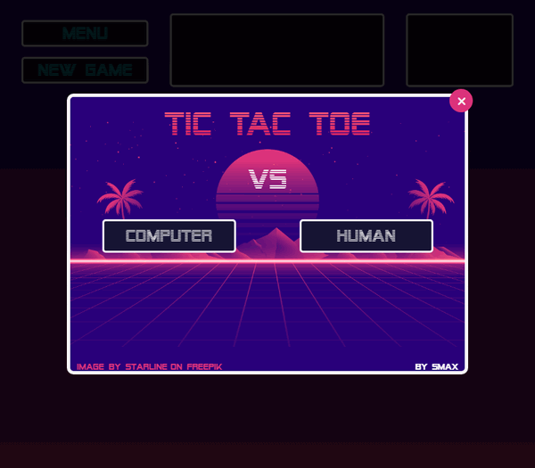

# Tic Tac Toe

A simple Tic-Tac-Toe game in Vanilla JavaScript - play against another human or against the computer (3 difficulty levels).



## Features

- Human vs. Human
- Human vs. Computer (Easy / Normal / Godlike)
- Win animation
- Score tracking

---

## Quick Start

### Option 1: Run directly in browser

1. Clone the repository:
   ```bash
   git clone https://github.com/Smax1988/Tic-Tac-Toe.git
   ```

2. Open `index.html` in your browser - done!

### Option 2: Integrate into your own project

1. Copy the files:
   - `src/scripts/` to your project
   - `src/styles/styles.css` to your project

2. Include in your HTML:
   ```html
   <script type="module">
     import TicTacToe from './src/scripts/classes/TicTacToe.js';

     document.addEventListener('DOMContentLoaded', () => {
       TicTacToe.initialize();
     });
   </script>
   ```

The game will automatically be prepended to the `<body>` element.

---

## Options

The `initialize()` function accepts two optional parameters:

| Parameter | Description | Default |
|-----------|-------------|---------|
| `element` | HTML element to prepend the game to | `document.body` |
| `cssPath` | Path to the CSS file | `"./src/styles/styles.css"` |

### Examples

**Prepend game to a specific element:**
```javascript
const container = document.getElementById('game-container');
TicTacToe.initialize(container);
```

**Specify custom CSS path:**
```javascript
TicTacToe.initialize(undefined, '/assets/css/tictactoe.css');
```

**Combine both:**
```javascript
const container = document.getElementById('game-container');
TicTacToe.initialize(container, '/assets/css/tictactoe.css');
```

---

## Installation via npm

```bash
npm install ttt-game
```

```javascript
import TicTacToe from 'ttt-game';

TicTacToe.initialize();
```

> **Note:** The CSS must be included separately - either as a `<link>` in your HTML or via the second parameter.

---

## Project Structure

```
Tic-Tac-Toe/
├── index.html                    # Demo page
├── src/
│   ├── scripts/
│   │   ├── classes/
│   │   │   ├── TicTacToe.js      # Main class (entry point)
│   │   │   ├── Board.js          # Game board logic
│   │   │   ├── Computer.js       # AI (including Minimax)
│   │   │   ├── GameResult.js     # Winner detection
│   │   │   ├── HtmlCreator.js    # DOM creation
│   │   │   └── RandomColorAnimation.js
│   │   └── ttt-game.js           # npm entry point
│   └── styles/
│       └── styles.css
├── docs/
│   └── demo.gif
└── README.md
```

---

## For ASP.NET Core Projects

<details>
<summary>Click to expand</summary>

### Option 1: CDN (simplest)

No installation required - load directly from unpkg:

```html
<div id="game-container"></div>

<script type="module">
  import TicTacToe from 'https://unpkg.com/ttt-game/scripts/ttt-game.js';

  const container = document.getElementById('game-container');
  TicTacToe.initialize(container, 'https://unpkg.com/ttt-game/styles/styles.css');
</script>
```

### Option 2: LibMan (local files)

Add to your `libman.json`:

```json
{
  "library": "ttt-game@1.0.9",
  "provider": "unpkg",
  "destination": "wwwroot/lib/ttt-game"
}
```

Then include in your Razor Page:

```html
<div id="game-container"></div>

<script type="module">
  import TicTacToe from '/lib/ttt-game/scripts/ttt-game.js';

  const container = document.getElementById('game-container');
  TicTacToe.initialize(container, '/lib/ttt-game/styles/styles.css');
</script>
```

### Option 3: npm + MSBuild (manual copy)

<details>
<summary>Click to expand</summary>

Install via npm:

```bash
npm install ttt-game
```

Add to your `.csproj` to copy files on build:

```xml
<Target Name="CopyTttGame" AfterTargets="Build">
  <ItemGroup>
    <TttFiles Include="node_modules/ttt-game/**/*.*" />
  </ItemGroup>
  <Copy SourceFiles="@(TttFiles)"
        DestinationFiles="@(TttFiles->'wwwroot/lib/ttt-game/%(RecursiveDir)%(Filename)%(Extension)')"
        SkipUnchangedFiles="true" />
</Target>
```

Then use the same include as Option 2.

</details>

</details>

---

## License

MIT
